<h1 align="center">
 Projeto: Internet das Coisas.
</h1>

<h4 align="center">
Projeto produzido a ser avaliado pela disciplina de M.I TEC 502 - Concorrência e Conectividade da Universidade Estadual de Feira de Santana. 
</h4>

 
<h2 align="center">
Implementação de um protótipo de dispositivo termostato, broker e aplicação.
</h2>

<h1 id="sumario" align="center">Sumário</h1>
<ul>
  <li><a href="#introducao"> <b>Introdução</b></li>
	 <li><a href="#fundamentacao-teorica"> <b>Fundamentação Teórica</b> </a> </li>
<li><a href="#desenvolvimento"> <b>Desenvolvimento e Descrição em Alto Nível</b> </a> </li>
      <li><a href="#descricao-e-analise-dos-testes"> <b>Descrição e Análise dos Testes e Simulações, Resultados e Discussões</b> </a></li>
	      <li><a href="#conclusao"> <b>Conclusão</b> </a></li>
  <li><a href="#script-de-compilacao"> <b>Como executar</b> </a></li>
</ul>

<h1 id="introducao" align="center">Introdução</h1> 

 
 A Internet das Coisas (IoT, do inglês Internet of Things) é uma tecnologia emergente que possibilita a conexão de objetos físicos à Internet, transformando-os em dispositivos inteligentes capazes de coletar e compartilhar dados. Nas últimas décadas, a IoT ganhou destaque em diversas áreas, incluindo saúde, energia, cidades inteligentes, manufatura e logística, onde proporciona soluções inovadoras e otimizadas.

No contexto de sistemas IoT, a interoperabilidade e a comunicação entre dispositivos e aplicações são cruciais para a implementação de sistemas integrados e eficientes. No entanto, esses sistemas enfrentam desafios relacionados à comunicação entre dispositivos, principalmente devido à diversidade de tecnologias, protocolos e padrões empregados.

Este projeto busca abordar esses desafios por meio do desenvolvimento de um serviço broker para facilitar a comunicação entre dispositivos e aplicações em um ambiente IoT. O broker é projetado para gerenciar a troca de mensagens entre clientes do serviço (dispositivos e aplicações).

Além do serviço broker, o projeto envolve a implementação de um simples dispositivo virtual simulado, como um termostato inteligente, capaz de gerar dados fictícios e receber comandos de controle. Uma aplicação permite controlar remotamente o dispositivo e visualizar os dados gerados, utilizando uma interface intuitiva.

A comunicação entre os diferentes componentes é estabelecida por meio de sockets TCP/IP, enquanto a interação entre a aplicação e o broker ocorre por meio de uma API RESTful. O projeto adota containers Docker para facilitar o desenvolvimento e a execução dos componentes de backend.

Neste relatório, são apresentados os detalhes da implementação dos diversos componentes do sistema, incluindo o dispositivo virtual, o serviço broker, a API RESTful e a aplicação de controle. A abordagem adotada para garantir a interoperabilidade entre dispositivos e aplicações, bem como os desafios enfrentados durante o desenvolvimento, também são discutidos.

<h1 id="fundamentacao-teorica" align="center">Fundamentação Teórica</h1>

Durante a criação do projeto foram utilizados importantes conceitos e recursos para garantir o desenvolvimento do mesmo. Nesta seção, serão discutidos tópicos fundamentais que apoiam a construção do projeto, desde o conceito de internet das coisas (IoT), comunicação entre dispositivos até a implementação de uma API RESTful para facilitar a interação entre aplicações e o serviço broker. Portanto, torna-se indispensável a sua compreensão para o entendimento da execução e funcionamento dos componentes do sistema IoT proposto.

<h2>Internet das coisas</h2>

A Internet das Coisas (IoT) é um conceito emergente que se desenvolveu nas últimas décadas, criando um ecossistema de dispositivos conectados que podem coletar e compartilhar dados por meio da Internet. Esses dispositivos abrangem uma ampla gama de objetos, desde itens domésticos até equipamentos industriais sofisticados. Portanto, compreender como esses dispositivos se comunicam entre si e com sistemas maiores é crucial para ter uma visão mais ampla do funcionamento do mundo físico.

O avanço da tecnologia, a diminuição do custo para  integrar a capacidade computacional a pequenos objetos e redes com alta largura de banda foram os principais responsáveis pela possibilidade e conexão de bilhões de dispositivos da rede. Esse progresso permitiu a possibilidade de objetos cotidianos de diferentes finalidades, como relógios, lâmpadas, carros e máquinas, utilizem sensores para coletar dados e interpretá-los para interagir de maneira mais assertiva e inteligente com os usuários.

Um típico sistema de IoT opera por meio da coleta e troca de dados em tempo real. Geralmente, esses sistemas possuem três componentes principais: dispositivos inteligentes, uma aplicação de IoT e uma interface gráfica do usuário. Os dispositivos inteligentes, como televisões, câmeras de segurança ou equipamentos de exercício, são equipados com capacidades de computação. Assim, eles coletam dados de seu ambiente, de entradas do usuário ou padrões de uso e comunicam esses dados pela Internet, de e para uma aplicação de IoT.

A aplicação de IoT é composta por serviços e softwares que integram dados recebidos de diversos dispositivos de IoT. Dessa forma, utiliza-se tecnologias como machine learning ou inteligência artificial (IA) para analisar esses dados e tomar decisões informadas. Essas decisões são então comunicadas de volta aos dispositivos de IoT, que respondem de maneira inteligente às entradas.

Por fim, a interface gráfica do usuário permite gerenciar um dispositivo de IoT ou uma frota deles. Exemplos comuns incluem uma aplicação móvel ou um site que pode ser usado para registrar e controlar esses dispositivos inteligentes.

<h2>Protocolos de Comunicação</h2>

Os protocolos de comunicação são conjuntos de regras e normas que definem como os dados devem ser transmitidos, recebidos e processados em um sistema de comunicação. Esses protocolos garantem que a comunicação entre dispositivos ou sistemas seja eficiente, confiável e segura, até mesmo em ambientes assíncronos. Assim, eles especificam aspectos como a estrutura das mensagens, o método de transmissão, o formato dos dados, a sequência de troca de informações, o tempo da comunicação, entre outros detalhes.

No contexto da Internet das Coisas (IoT), os protocolos de comunicação desempenham um papel crucial para permitir a troca de dados entre dispositivos conectados e sistemas de análise ou controle. Além disso, a iminência de protocolos possibilitam a interconexão entre dispositivos de diferentes fabricantes, garantindo que esses dispositivos possam se comunicar de maneira padronizada, mesmo que utilizem tecnologias distintas.

Existem diversos tipos de protocolos que ditam a comunicação na rede. Sua classificação pode ser avaliada pelo desempenho e funcionalidade que exerce. Um protocolo de transmissão, por exemplo, refere-se ao método usado para enviar dados de um dispositivo a outro. Pode ser confiável (garantindo a entrega e confirmação de recebimento, como o TCP) ou não confiável (priorizando a velocidade de transmissão, como o UDP).

Ademais, tem-se também protocolos de aplicação que definem como as aplicações se comunicam entre si usando protocolos de transporte (um exemplo é o protocolo HTTP, usado para comunicação entre clientes e servidores web). Além disso, tem-se também protocolos de mensagens que ditam o formato e a estrutura que as mensagens trocadas entre dispositivos devem possuir. Exemplos desse último incluem JSON e XML, que são frequentemente usados para formatar dados em sistemas, sobretudo  IoT.

Enfim, os protocolos de comunicação são fundamentais para permitir a integração e o funcionamento eficiente de sistemas no geral, uma vez que garantem a interconexão e a confiabilidade da troca de informações entre dispositivos conectados.

<h3>Modelo de transmissão TCP/IP</h3>

O modelo TCP/IP é o conjunto de regras e procedimentos que permite a comunicação entre dispositivos em uma rede. Desenvolvido inicialmente pelo Departamento de Defesa dos Estados Unidos na década de 1970, ele estabeleceu as bases para a arquitetura da internet moderna.

Este modelo pode ser representado por quatro camadas distintas: a camada de aplicação, a camada de transporte, a camada de internet e a camada física (Figura 1). 

	

Figura 1. Camadas do modelo TCP/IP.

Na Camada de Link de Dados, a transmissão confiável de dados ocorre em um único link de comunicação, utilizando protocolos como Ethernet, Wi-Fi e PPP. A Camada de Internet gerencia o endereçamento IP, o roteamento de pacotes e a fragmentação, sendo responsável pelos protocolos IPv4 e IPv6.

A Camada de Transporte oferece comunicação de host-a-host, garantindo a entrega ordenada e confiável dos dados. Para isso, utiliza os protocolos TCP (Transmission Control Protocol) e UDP (User Datagram Protocol). Por fim, a Camada de Aplicação fornece serviços de comunicação diretamente para aplicativos e usuários finais, incluindo protocolos como HTTP, FTP e SMTP.

O funcionamento do Modelo TCP/IP envolve o encapsulamento de dados, onde cada camada adiciona cabeçalhos aos dados recebidos da camada superior, formando pacotes ou segmentos. Esses cabeçalhos contêm informações de controle necessárias para o roteamento e a entrega dos dados. A transmissão de dados ocorre de uma camada para a próxima através de protocolos específicos, com a Camada de Internet sendo responsável pelo roteamento dos pacotes utilizando endereços IP.

No processo de entrega e recepção, os dados são entregues ao aplicativo de destino na Camada de Aplicação, onde são interpretados e processados conforme necessário. Este modelo oferece escalabilidade, flexibilidade e padronização, sendo amplamente adotado para comunicação em redes de computadores em todo o mundo.

<h3>Protocolo HTTP</h3>

O protocolo HTTP (HyperText Transfer Protocol) é um protocolo de aplicação amplamente utilizado na comunicação entre clientes e servidores na Internet. Projetado no início da década de 1990 e desenvolvido ao longo do tempo, ele é a principal base para a transferência de dados na World Wide Web, permitindo a troca de informações entre navegadores web (clientes) e servidores web. O HTTP também é uma parte essencial de muitas aplicações web e APIs (Application Programming Interfaces) modernas

Clientes e servidores se comunicam trocando mensagens individuais (ao contrário de um fluxo de dados). As mensagens enviadas pelo cliente, geralmente um navegador da Web, são chamadas de solicitações (requests), ou também requisições, e as mensagens enviadas pelo servidor como resposta são chamadas de respostas (responses).

Esse protocolo atua na camada de aplicação e é enviado sobre o protocolo TCP, ou em uma conexão TCP criptografada com TLS, embora qualquer protocolo de transporte confiável possa, teoricamente, ser usado. Devido à sua extensibilidade, ele é usado não só para buscar documentos de hipertexto, mas também imagens e vídeos ou publicar conteúdo em servidores. O HTTP também pode ser usado para buscar partes de documentos para atualizar páginas da Web sob demanda.

O HTTP opera com um modelo de requisição-resposta, onde o cliente envia uma requisição ao servidor e o servidor retorna uma resposta ao cliente. As requisições e respostas são compostas por cabeçalhos (headers) que fornecem informações sobre a mensagem, como tipo de conteúdo, tamanho, método, status, entre outros.
O protocolo define vários métodos para realizar diferentes tipos de operações. Os métodos mais comuns são:

- GET: Solicita dados do servidor.

- POST: Envia dados ao servidor para criação ou processamento.

- PUT: Atualiza recursos existentes no servidor.

- DELETE: Remove recursos do servidor.

- PATCH: Aplica atualizações parciais a um recurso.
- 
As respostas HTTP incluem códigos de status que indicam o resultado da requisição do cliente. Por exemplo:

- 2xx: Indica sucesso (por exemplo, 200 OK).

- 4xx: Indica um erro no cliente (por exemplo, 404 Not Found).

- 5xx: Indica um erro no servidor (por exemplo, 500 Internal Server Error).

O HTTP é um protocolo sem estado, o que significa que cada requisição é independente e não mantém informações sobre requisições anteriores. Se o estado for necessário, cabe ao cliente e servidor implementar esse gerenciamento.

<h2>Socket</h2>

Um socket é uma interface de comunicação que permite que programas de computador se comuniquem entre si através de uma rede. Ele é usado para estabelecer uma conexão de rede entre dois dispositivos, permitindo a troca de dados em tempo real. Essa interface permite com que o desenvolvedor se comunique com a camada de transporte sem que ele precise entender todo o funcionamento e complexidade que essa camada apresenta. Em geral, têm-se dois tipos principais de sockets: os sockets TCP e os sockets UDP. Os sockets TCP (Transmission Control Protocol) são utilizados em comunicações que requerem uma conexão confiável e orientada à conexão, como transferência de arquivos e navegação na web. Eles garantem a entrega ordenada e confiável dos dados, com controle de fluxo e retransmissão de pacotes perdidos. Já os sockets UDP (User Datagram Protocol) são utilizados em comunicações que exigem uma conexão menos robusta e mais rápida, como streaming de áudio e vídeo e jogos online. Eles não são orientados à conexão e não garantem a entrega dos dados, mas oferecem uma latência menor e são mais adequados para transmissões em tempo real.

<h2>Serviço Broker</h2>

 Um serviço de broker é um componente intermediário que facilita a comunicação assíncrona entre sistemas distribuídos. Ele atua como um intermediário entre produtores e consumidores de mensagens, armazenando e roteando mensagens de forma confiável e eficiente.Esses serviços geralmente implementam filas de mensagens, onde os produtores publicam mensagens e os consumidores as consomem conforme necessário. Isso permite que os sistemas se comuniquem de forma desacoplada, ou seja, sem que o produtor e o consumidor precisem estar cientes um do outro em tempo real.Os serviços de broker podem utilizar diferentes protocolos e tecnologias, como MQTT, AMQP, Kafka, entre outros. Cada tecnologia tem suas próprias características e adequações para diferentes cenários de uso, como escalabilidade, confiabilidade e suporte a diferentes padrões de mensageria.Esses serviços são amplamente utilizados em arquiteturas de microsserviços, sistemas de mensageria, integração de aplicativos e IoT (Internet das Coisas), fornecendo uma base sólida para a comunicação entre sistemas distribuídos em larga escala.

<h2>API RESTFUL</h2>

Uma API (Interface de Programação de Aplicações) é um conjunto de definições de protocolos e ferramentas que permite a comunicação entre diferentes softwares. Ela define os métodos e formatos de dados que os aplicativos podem usar para solicitar e enviar informações uns aos outros. As APIs podem ser baseadas em diferentes tecnologias, como HTTP, SOAP, ou RPC, e podem oferecer diferentes níveis de acesso e funcionalidades. Elas são utilizadas para facilitar a integração entre sistemas e serviços, permitindo que aplicativos compartilhem dados e funcionalidades de forma eficiente e segura. As APIs são essenciais para o desenvolvimento de aplicações distribuídas e para a criação de ecossistemas de software interoperáveis. Em geral, as APIs  fornecem uma interface clara e documentada para que desenvolvedores possam utilizar funcionalidades específicas de um software ou serviço sem precisar entender sua implementação interna.

Nesse contexto, API RESTful é uma abordagem para criar serviços web que segue os princípios da arquitetura REST (Representational State Transfer). Dessa forma, os recursos são modelados como objetos acessíveis por meio de URLs e manipulados utilizando os métodos HTTP padrão, como GET, POST, PUT e DELETE. Cada recurso é identificado por um URI (Uniform Resource Identifier), e as operações sobre esses recursos são realizadas por meio dos métodos HTTP correspondentes. A API RESTful é stateless, o que significa que cada requisição do cliente contém todas as informações necessárias para ser processada pelo servidor, e cada resposta do servidor contém todas as informações necessárias para o cliente entender e processar a resposta. Isso torna as APIs RESTful simples, escaláveis e fáceis de entender e implementar. Elas são amplamente utilizadas na indústria devido à sua flexibilidade e capacidade de integração com diferentes tecnologias e plataformas.

<h2>Sistemas de Containers Docker</h2>

O Docker é uma plataforma de software que permite a criação, implantação e execução de aplicativos em containers. Os containers são uma forma de virtualização leve, onde cada aplicativo e suas dependências são isolados em um ambiente encapsulado. Isso, por sua vez, permite que os aplicativos sejam executados de forma consistente em qualquer ambiente, independentemente das diferenças de infraestrutura. O Docker utiliza uma arquitetura cliente-servidor, onde o cliente interage com o daemon do Docker para construir, gerenciar e executar containers. Os containers Docker são baseados em imagens, que são arquivos de sistema somente leitura contendo o código, as bibliotecas e as dependências necessárias para executar um aplicativo. Essas imagens são distribuídas e armazenadas em repositórios Docker, como o Docker Hub. O Docker tem sido amplamente adotado na indústria devido à sua facilidade de uso, portabilidade e eficiência na utilização de recursos. Assim, permitindo com que os desenvolvedores empacotem seus aplicativos e todas as suas dependências em um único pacote, facilitando a implantação e a escalabilidade de aplicativos em qualquer ambiente de computação.

<h1 id="desenvolvimento" align="center">Desenvolvimento, metodologia, implementações e teses</h1>

A primeira etapa para o desenvolvimento do projeto foi a criação de um simples diagrama que pudesse ilustrar como seria a comunicação entre os três principais atores (Figura 2), sendo eles: o broker, a aplicação e o dispositivo.

	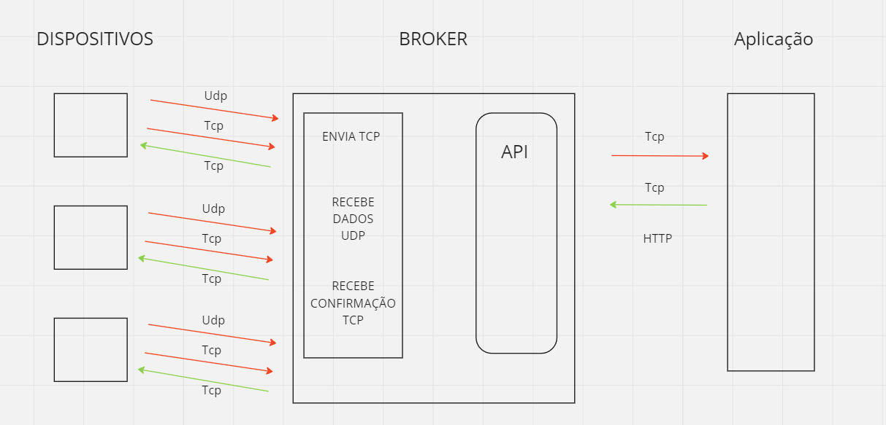

Figura 2. Diagrama para representar as interações entre os principais atores do projeto.

O diagrama de comunicação revela que a interação entre a aplicação e o broker ocorre por meio de uma API que utiliza requisições HTTP, operando sobre o protocolo TCP. Essas requisições são utilizadas para transmitir comandos e receber respostas, representando eventos de sucesso ou falha, também via TCP. Por outro lado, a comunicação do dispositivo com o broker é realizada tanto por TCP quanto por UDP. O dispositivo recebe comandos do broker por meio de conexões TCP e envia seus dados utilizando o protocolo UDP. É relevante notar que o dispositivo emprega conexões TCP para enviar comandos de confirmação ao broker, garantindo a integridade e a confiabilidade da comunicação bidirecional.

<h2>Broker</h2>

O broker desenvolvido atua como intermediário entre os dispositivos termostato e a aplicação de controle, garantindo a troca de requisições e mensagens entre esses. Ele utiliza comunicação via TCP e UDP para se conectar aos termostatos, além de expor uma API HTTP utilizando Flask para receber comandos da aplicação. O broker é configurado para operar em um host e portas específicas para TCP, UDP e HTTP.

Inicialmente, o broker cria sockets TCP e UDP e tenta fazer a ligação nos respectivos endereços e portas. Para a comunicação TCP, o broker se configura para aceitar até cinco conexões simultâneas. Quando uma nova conexão é estabelecida, o broker identifica se o cliente conectado é um dispositivo termostato ou um cliente genérico, registrando os dispositivos identificados em um dicionário para assim permitir o seu controle e monitoramento.

O broker mantém uma lista de dispositivos conectados e verifica continuamente a conectividade desses dispositivos, enviando mensagens de confirmação periodicamente. Se um dispositivo não responder, ele é removido da lista de dispositivos conectados. A recepção de mensagens via UDP é gerenciada por uma thread dedicada que coloca as mensagens recebidas em uma fila para processamento posterior. Da mesma forma, a recepção de mensagens via TCP é gerenciada por uma thread que processa mensagens recebidas de dispositivos conectados.

As mensagens UDP são tratadas por outra thread, que interpreta os dados recebidos, atualizando o estado e a temperatura dos dispositivos conforme necessário. Já os comandos HTTP, recebidos através de uma API exposta pelo Flask, são colocados em uma fila específica para comandos HTTP. Esses comandos são processados por uma thread dedicada, que envia as instruções apropriadas aos dispositivos registrados.

A estrutura das mensagens enviadas e recebidas pelo broker é baseada em strings delimitadas por hifens. Mensagens de identificação seguem o formato "device-ID-status-temperature" ou "client-ID", dependendo se a conexão é de um dispositivo ou de um cliente. Para comandos HTTP, as mensagens têm o formato "HTTPcommand-ID-command-new_temperature", onde "command" pode ser "on", "off" ou "newtemp". Mensagens UDP enviadas pelos dispositivos seguem o formato "dispositive_data-ID-status-temperature", permitindo ao broker atualizar o estado e a temperatura dos dispositivos. Estas mensagens são decodificadas e processadas conforme seu tipo, garantindo que as informações sejam corretamente interpretadas e utilizadas.

A API HTTP do broker, implementada com Flask, oferece endpoints para listar os dispositivos conectados e enviar comandos a eles. A listagem dos dispositivos retorna informações como ID, endereço IP, porta, estado e temperatura atual de cada dispositivo. O envio de comandos permite controlar o estado (ligar/desligar) e ajustar a temperatura dos dispositivos termostato. A validação e interpretação dos comandos são feitas para garantir que apenas comandos válidos sejam processados.

O broker utiliza diversas threads para garantir que as operações de rede e processamento de comandos ocorram de maneira assíncrona e eficiente, permitindo uma operação contínua e responsiva. A integração do Flask permite uma interface HTTP amigável para interagir com os dispositivos, facilitando o controle e monitoramento remotos.

Em resumo, o broker implementado no código serve como um hub central para gerenciar a comunicação entre dispositivos termostato e uma aplicação de controle, utilizando TCP e UDP para comunicação com dispositivos e HTTP para interação com a aplicação. A arquitetura baseada em threads e filas garante uma operação robusta e eficiente, adequada para cenários de automação residencial e industrial.

<h2>Aplicação</h2>

A interface da aplicação para o termostato inteligente foi desenvolvida utilizando HTML e JavaScript, visando proporcionar uma interação simples e eficiente para monitorar e controlar os dispositivos termostatos conectados. A página HTML é composta por um título que identifica a aplicação, um botão que, ao ser clicado, exibe os dispositivos disponíveis, e uma área de conteúdo dinâmica onde as informações dos dispositivos são exibidas. A funcionalidade principal é gerida por um script JavaScript, que realiza chamadas assíncronas à API do broker para obter a lista de dispositivos, atualizando a exibição a cada três segundos. Quando a lista de dispositivos é recuperada, a função displayDevices é acionada, criando elementos HTML para exibir as informações de cada dispositivo, incluindo seu ID, estado, temperatura, endereço IP e porta TCP. Para cada dispositivo, são adicionados controles que permitem ligar e desligar o dispositivo, além de um seletor para enviar uma nova temperatura.

As ações de controle (ligar, desligar, enviar nova temperatura) são realizadas através de funções JavaScript assíncronas (turnOnDevice, turnOffDevice, sendNewTemperature), que constroem uma mensagem de comando e a enviam para a API do broker utilizando o método fetch. Cada função constrói a mensagem no formato específico esperado pelo broker, que inclui o tipo de comando, ID do dispositivo, endereço IP, porta e os parâmetros de controle (como o novo valor de temperatura). 

A estrutura das mensagens enviadas via HTTP na aplicação do termostato inteligente segue o mesmo formato padronizado para facilitar a comunicação entre a interface web e o broker. As mensagens são strings compostas por diferentes partes separadas por hífens, organizadas da seguinte forma: "HTTPcommand-ID-IP-port-command-temperature". Aqui, "HTTPcommand" indica que é um comando vindo da interface web, "ID" é o identificador do dispositivo, "IP" é o endereço IP do dispositivo, "port" é a porta TCP do dispositivo, "command" pode ser "on", "off", ou "newtemp" dependendo da ação desejada, e "temperature" específica a nova temperatura a ser configurada. Esta estrutura clara e organizada permite que o broker interprete facilmente as intenções dos comandos enviados, garantindo uma comunicação eficiente e precisa.

Na aplicação do termostato, a interface web utiliza dois métodos HTTP principais para interagir com o broker: GET e POST, cada um servindo a propósitos distintos. O método GET é usado para recuperar informações sobre os dispositivos conectados, especificamente através do endpoint "/get-devices". Quando o botão "Exibir dispositivos" é clicado, uma requisição GET é enviada a este endpoint, e o servidor responde com uma lista de dispositivos, incluindo seu ID, estado, temperatura, endereço IP e porta TCP. A resposta é então usada para atualizar a visualização na interface web, exibindo os detalhes dos dispositivos de maneira organizada.

Por outro lado, o método POST é utilizado para enviar comandos ao broker, que são então repassados aos dispositivos. Estes comandos são enviados para o endpoint "/send-command". Quando um usuário deseja ligar ou desligar um dispositivo ou alterar sua temperatura, uma requisição POST é feita, contendo um payload JSON que inclui a mensagem formatada. Esta mensagem segue a estrutura "HTTPcommand-ID-IP-port-command-temperature", onde os campos especificam a ação desejada e as informações do dispositivo alvo. O servidor recebe essa requisição, coloca o comando na fila de processamento HTTP e responde com uma confirmação de sucesso ou um erro, dependendo do resultado da operação. Esse uso coordenado dos métodos GET e POST permite uma interação eficiente e eficaz entre a interface web e os dispositivos termostatos, garantindo que os usuários possam monitorar e controlar os dispositivos em tempo real.

As respostas da API são tratadas para fornecer feedback ao usuário, alertando sobre o sucesso ou falha da operação. A interface garante que as interações do usuário sejam intuitivas e que as informações dos dispositivos sejam atualizadas em tempo real, proporcionando um controle preciso e eficiente dos termostatos conectados à rede.

<h2>Dispositivo</h2>

O dispositivo escolhido para a simulação de dados foi um termostato, que possui algumas funcionalidades simples como ligar ou desligar e mudar a temperatura. O termostato inicia estabelecendo uma conexão TCP com um broker para receber comandos de controle. O processo de conexão inclui tentativas contínuas até que a conexão seja bem-sucedida, garantindo robustez em cenários onde o broker pode não estar inicialmente disponível. Uma vez conectado, o termostato envia uma mensagem de identificação ao broker contendo seu ID, status e temperatura inicial. Isso permite que o broker reconheça e registre o dispositivo adequadamente. Paralelamente à conexão TCP, o termostato também configura uma conexão UDP, utilizada para enviar dados periódicos ao broker, garantindo a comunicação de estado em intervalos regulares. Essa comunicação via UDP garante que o estado do termostato esteja sempre atualizado no broker, essencial para a monitorização em tempo real do dispositivo

Uma thread dedicada envia periodicamente mensagens via UDP contendo o estado atual do termostato. Esta thread opera de forma contínua em segundo plano, enviando atualizações a cada dois segundos. Ademais, outra thread é dedicada ao recebimento de comandos via TCP, permanecendo ativa durante toda a operação do termostato, ouvindo mensagens do broker e processando-as conforme necessário. O termostato pode ser ativado ou desativado remotamente através de comandos recebidos via TCP. Os comandos são processados e o status do dispositivo é atualizado de acordo. O dispositivo também pode receber comandos para ajuste de temperatura. Quando um novo valor é recebido, o termostato valida e atualiza sua temperatura, respondendo ao broker com uma confirmação do comando.

Válido destacar também, que o dispositivo inclui mecanismos para reconectar automaticamente ao broker em caso de perda de conexão, assegurando que o dispositivo permaneça operacional e responsivo mesmo em condições de rede instáveis.

A emulação de um termostato serve para demonstrar uma aplicação prática de comunicações TCP e UDP para controle e monitoramento remoto. A utilização de threads permite uma operação assíncrona eficiente, garantindo que o dispositivo possa responder rapidamente a comandos e fornecer atualizações de estado em tempo real. Este modelo é extensível e pode ser adaptado para uma variedade de dispositivos IoT, proporcionando uma base sólida para desenvolvimento de sistemas de automação residencial e industrial.

<h1 id="descricao-e-analise-dos-testes" align="center">Resultados e Discussões</h1>

Na etapa final do projeto proposto, obteve-se excelentes resultados conforme as especificações desejadas, o sistema realiza a leitura e entrega precisa dos dados solicitados e a interface desenvolvida cumpre diretamente com seu papel interativo e ilustrativo, assim proporcionando uma melhor tomada de decisão por parte do usuário que a opera. A eficácia do projeto como um todo demonstra a compreensão dos principais tópicos exigidos.

O uso da interface se dará através de uma interação simples e intuitiva por parte do usuário. Nesse caso, aparecerá um botão escrito “Exibir dispositivos”, ao ser pressionado será exibido um painel com todos os dispositivos termostatos disponíveis, incluindo seu ID, estado atual (ligado ou desligado) e temperatura atual. Caso nenhum dispositivo esteja conectado, não será exibido nada. Além disso, será possível realizar ações como ligar ou desligar um dispositivo termostato específico, bem como ajustar sua temperatura para um valor desejado. Essas interações serão feitas através de botões na interface.

Para garantir a funcionalidade e integridade da interface do usuário, do broker e do dispositivo termostato simulado foram produzidos os seguintes testes:

-	Verificação dos dispositivos e recursos disponíveis na interface de aplicação do usuário; 
-	Solicitação para alterar o estado do dispositivo termostato (ligado ou desligado);
-	Verificação da opção de trocar a temperatura do dispositivo termostato;
-	Verificação da tentativa de conexão do dispositivo termostato com o broker desativado;

<h2>Verificação dos dispositivos e recursos disponíveis na interface de aplicação do usuário</h2>

Na figura 3 é possível ver o terminal do broker com as informações de duas novas conexões recém estabelecidas, nesse caso do dispositivo 1 (IP: 127.0.0.1 e porta TCP: 49300) e do dispositivo 2 (IP: 127.0.0.1 e porta TCP: 49302). A figura 4 mostra os dispositivos exibidos na tela da aplicação com todos os seus status atuais, incluindo o ip e porta dos dispositivos conectados ao broker.

	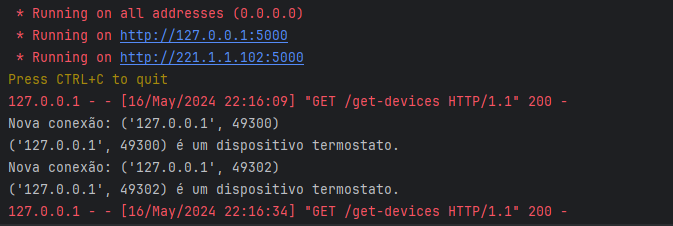

Figura 3. Terminal do broker indicando novas conexões.

	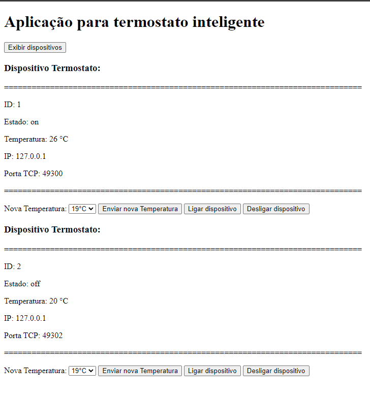

Figura 4. Exibição dos dispositivos na tela da aplicação.

<h2>Solicitação para alterar o estado do dispositivo termostato (ligado ou desligado)</h2>

Na figura 5, têm-se a confirmação da solicitação do comando para ligar o dispositivo 2. Em seguida, percebe-se, através da figura 6, que o comando chega até o terminal do broker. A figura 7 mostra o dispositivo após com o seu status alterado para "on".

	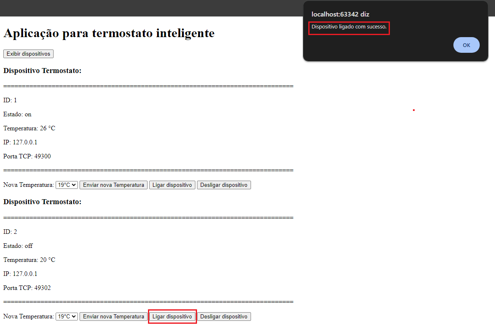

Figura 5. Confirmação da solicitação do comando para ligar o dispositivo 2.

	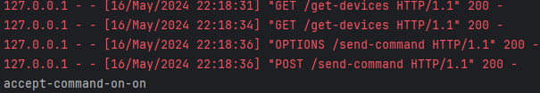

Figura 6. Comando recebido pelo broker.

	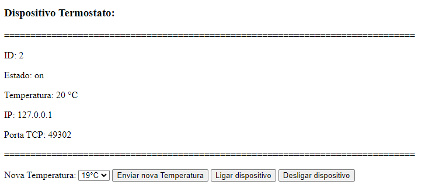

Figura 7. Dispositvo com estado alterado para "on".

<h2>Verificação da opção de trocar a temperatura do dispositivo termostato</h2>

Na figura 8, têm-se a confirmação da solicitação do comando para alterar a temperatura do dispositivo 1 para 24°C. Em seguida, percebe-se, através da figura 9, que o comando chega até o terminal do broker. A figura 10 mostra o dispositivo com sua nova temperatura.

	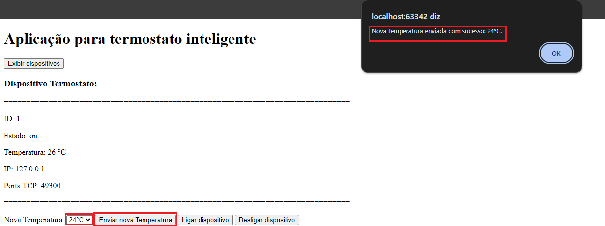

Figura 8. Confirmação da solicitação do comando para alterar a temperatura do dispositivo 1 para 24°C.

	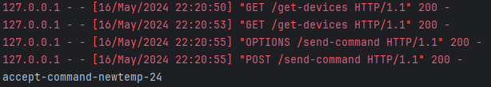

Figura 9. Comando recebido pelo broker.

	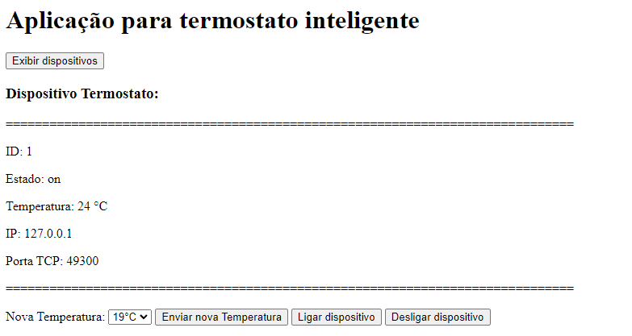

Figura 10. Dispositvo com temperatura alterada para 24°C.

<h2>Verificação da tentativa de conexão do dispositivo termostato com o broker desativado</h2>

Na figura 11, têm-se a imagem do terminal do dispositivo 1 após ser ligado tentando conexão com o broker que está desligado. Logo após ligar o broker, percebe-se uma menssagem de conexão aceita no terminal do dispositivo (Figura 12).

	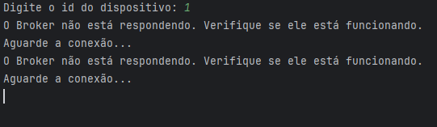

Figura 11. Terminal do dispositivo 1 indicando a tentativa de conexão com o broker desligado.

	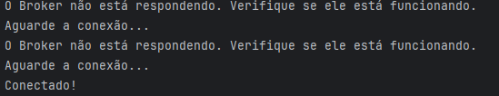

Figura 12. Terminal do dispositivo 1 indicando o sucesso da conexão com o broker após o mesmo ser ligado.

<h1 id="conclusao" align="center">Conclusão</h1>

	O desenvolvimento do projeto proposto demonstrou a importância e a complexidade dos sistemas de Internet das Coisas (IoT) ao integrar dispositivos, aplicações e serviços. A implementação de um serviço broker para facilitar a comunicação entre dispositivos e aplicações foi essencial para permitir a troca de mensagens em tempo real, utilizando a infraestrutura de rede, bem como a manipulação de sockets para comunicação via protocolos UDP e TCP. Ademais, o uso de dispositivos virtuais simulados, como um termostato inteligente, auxiliou na validação do sistema, fornecendo insights valiosos sobre seu comportamento em um ambiente controlado.

A criação de uma aplicação capaz de gerenciar e controlar remotamente os dispositivos de IoT, além de visualizar os dados gerados, destacou a relevância de uma interface intuitiva para interação com os usuários. A integração de uma API RESTful com o serviço broker possibilitou a comunicação eficaz entre as diferentes camadas do sistema, garantindo a interoperabilidade e a eficiência do projeto.

Além disso, os desafios enfrentados durante o desenvolvimento do projeto, como a escolha de protocolos de comunicação e padrões de mensagens, foram superados por meio da adoção de práticas de design cuidadosas e da utilização de tecnologias modernas, como containers Docker.

Em suma, o projeto exemplifica o potencial da IoT em aplicações práticas e destaca a necessidade de uma abordagem sistemática para lidar com a comunicação e a integração de dispositivos em ambientes IoT. A experiência adquirida ao longo do desenvolvimento oferece uma base sólida para futuras implementações e inovações no campo da Internet das Coisas.

<h1 id="script-de-compilacao" align="center">Como executar o projeto</h1> 

O projeto consta com dois arquivos principais: "thermostat.py" e "broker.py". Ambos são executados em containers Docker. Siga as instruções abaixo para configurar e executar o sistema.

Para executar o termostato, siga os passos abaixo:

*	Entre pelo terminal.
*	Navegue até a pasta "Device", onde o arquivo "thermostat.py" está localizado.
*	Execute o comando:
* 		 docker container run -it -e BROKER_IP=(digite o IP do broker) thermostat

Para executar o broker, siga os passos abaixo:

*	Entre no terminal.
*	Navegue até a pasta "Broker", onde o arquivo "broker.py" está localizado.
*	Execute o comando:
*		 docker run -p 8888:8888 -p 9999:9999/udp -p 5001:5001 broker
	
Para executar a aplicação, abra o arquivo "Client.html" pelo navegador.

Lembre-se de verificar se o IP cadastrado no "Client.html" é o mesmo IP da máquina onde o broker está rodando.
